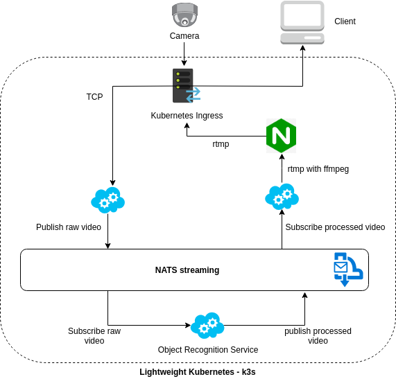

# Object Recognition Experiment on Fog Computing Environment using Lightweight Kubernetes (k3s)

For special assignment course, 5 credits. Aalto University, Espoo, Finland. 

## System Architecture


This architecture is influenced by these articles:
- https://nats.io/blog/how-clarifai-uses-nats-and-kubernetes-for-machine-learning/
https://dzone.com/articles/real-time-high-performance-machine-learning-using
- https://nats.io/blog/how-clarifai-uses-nats-and-kubernetes-for-machine-learning/
https://dzone.com/articles/real-time-high-performance-machine-learning-using

## Devices
- Raspberry Pi 3 Model B (2 items)
- Intel fog reference design (1 item)

## Setting Up k3s Cluster
- Information about k3s: https://k3s.io/
- Useful tutorial: https://blog.alexellis.io/test-drive-k3s-on-raspberry-pi/ 

1. Disable swap memory on all devices in the cluster.
2. Set static IPs for all devices in the cluster to make life easier.
3. In this experiment, one of the Raspberry Pi is the kubernetes master and the rest of the devices in the cluster are workers.
4. On the master, install k3s using the command:
```bash
curl -sfL https://get.k3s.io | sh -
```
5. After installing on the master, we need to know the "token" from the master so that other nodes can join the k3s cluster. To print the token, on the master, run this:
```bash
cat /var/lib/rancher/k3s/server/node-token
```
6. I don't know if it's a good idea to install the k3s with the same way as the way we install it on the master. On the node, I downloaded k3s from here https://github.com/rancher/k3s/releases and place it in /usr/local/bin
7. The worker can join the cluster by issuing:
```bash
sudo -E k3s agent -s ${MASTER_IP} -t ${NODE_TOKEN}
```
8. In the master, make sure the workers have joined the cluster by issuing:
```bash
k3s kubectl get node -o wide
```
## Building Docker Multiarch Images
The docker images must run on multiple CPU architecture, since the aim of this project is to deploy it on kubernets consisting of heterogeneous devices.

The instructions on how to build docker images with multiarch support can be found here: https://lobradov.github.io/Building-docker-multiarch-images/

*note*: The source code on the [Lobradov's tutorial](https://lobradov.github.io/Building-docker-multiarch-images/) seems to be broken, so I forked and changed a little: https://github.com/adikabintang/docker-multiarch-builder 

## Object Detection
```
Why YOLOv3? Why not SSD?
```

See this: https://hackernoon.com/efficient-implementation-of-mobilenet-and-yolo-object-detection-algorithms-for-image-annotation-717e867fa27d
```
Hence choose SSDs on good microprocessors, else YOLO is the goto for microprocessor-based computations.
```
We only use Intel FRD here, so no GPU involved. Why?
Because working with `jetson tx1 + docker + tensorrt + tensorflow + cuda = me half crazy`. The problem is with `dockerizing` all of these. It does not run out of the box and due to time limitation, let's be healthy. Check this [issue](https://github.com/NVIDIA/nvidia-docker/issues/214) out. If they support it by the time you read this sentence, the game may change.
